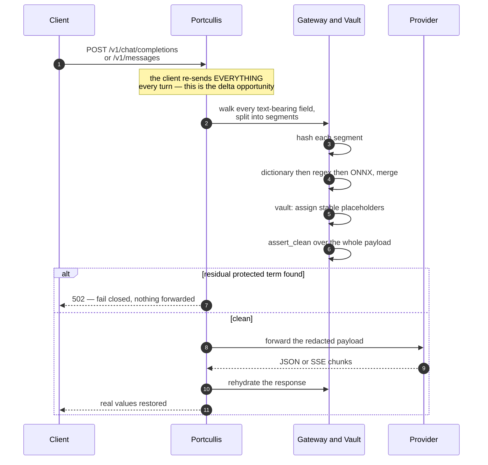
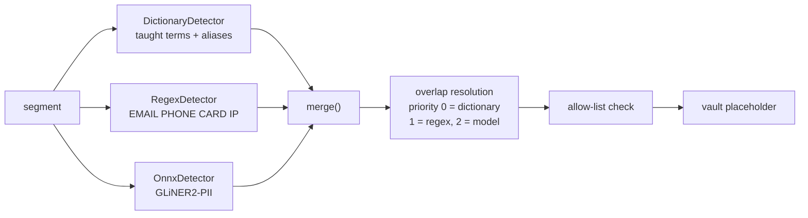
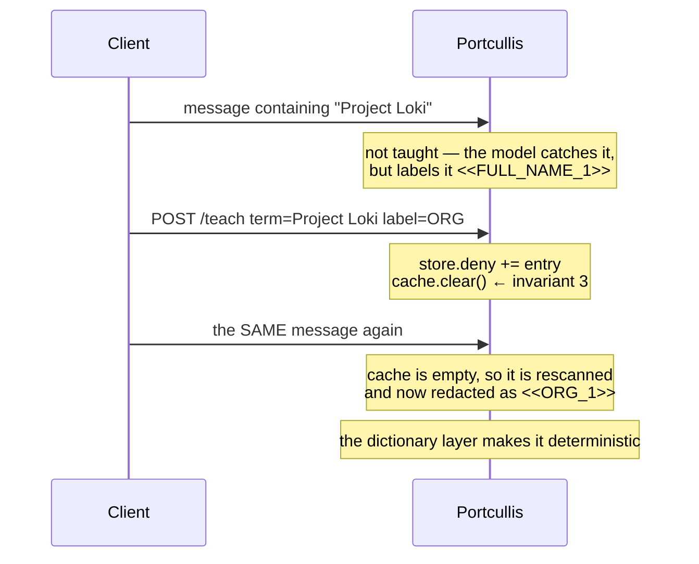

# Architecture — how a prompt flows

## The 30-second version

The insight that drives the whole design: **LLM APIs are stateless.** Every turn, your
client re-sends the *entire* conversation — system prompt, full history, new turn. Only
the response is new.

So Portcullis sits on that boundary and cleans the payload on the way out, then cleans up
after itself on the way back.

```mermaid
flowchart TD
    A["Client: Hermes / Claude Code / OpenCode / Cursor"] -->|"sends the FULL conversation<br/>every single turn"| B["Portcullis :8080<br/>local only"]
    B --> C{"segment seen before?<br/>sha256 in the delta cache"}
    C -- yes --> D["re-emit the REDACTED form<br/>(never the raw bytes)"]
    C -- no --> E["detect spans"]
    E --> E1["1. dictionary<br/>taught terms = the guarantee"]
    E1 --> E2["2. regex<br/>email / phone / card / IP"]
    E2 --> E3["3. ONNX GLiNER2<br/>best-effort recall"]
    E3 --> F["merge<br/>dictionary then regex then model"]
    F --> G["vault: real value &#8596; stable placeholder"]
    G --> H["cache sha256(segment) &#8594; redacted"]
    H --> I["assert_clean over the WHOLE payload"]
    D --> I
    I -- leak found --> J["502 — nothing is forwarded"]
    I -- clean --> K["forward to the provider"]
    K --> L["response: JSON or SSE stream"]
    L --> M["rehydrate via the vault"]
    M --> N["client sees the real values again"]
```

## The two sides of the boundary

| | The provider sees | You see |
|---|---|---|
| System prompt | `You are the assistant for <<ORG_1>>. The account manager for <<ORG_2>> is <<PERSON_1>>.` | the real names |
| Your message | `Draft a follow-up to <<PERSON_1>> about the <<ORG_1>> renewal. Direct line <<PHONE_1>>.` | the real email, phone, client |
| The reply | coherent, task-shaped | rehydrated with real values |

The provider gets a coherent task. It never receives an identity.

## Full request lifecycle

## Where each safety invariant lives

| Invariant | Enforced in |
|---|---|
| 1. Never echo a raw segment | `Gateway::process` — a cache hit re-emits the cached **redacted** form, never the input |
| 2. No bypass | `handle()` walks *every* text-bearing field of *every* message, including the system prompt |
| 3. Invalidate on policy change | `Gateway::teach` / `unteach` call `cache.clear()` |
| 4. Fail closed | `assert_clean(entire serialized payload)` runs **before** the upstream call; any error is a 502 |

## The redaction pipeline, in detail

Segments are scanned by three independent detectors, then merged:

**Merge priority matters.** On overlapping spans the deterministic layers win: dictionary
(0) → regex (1) → model (2). The ML detector can therefore only ever *add* recall — it can
never override or weaken the guarantee.

The **allow-list** is consulted last: a value on it is emitted as-is even if a detector
flagged it, and it is skipped by `assert_clean`.

## The vault: why placeholders are stable

`<<EMAIL_1>>` is a **pure function of the value**, not a counter over the conversation.

Two consequences, both load-bearing:

1. **The model stays coherent** — it can refer back to `<<PERSON_1>>` across turns.
2. **The provider's prompt cache is preserved** — untouched segments are re-emitted
   byte-identically, so deterministic redaction *saves* tokens rather than costing them.

Rehydration is tolerant: whitespace, case and surrounding punctuation are matched
loosely, so a model that reformats a placeholder still gets restored correctly.

## The delta cache: why it's fast

Measured on the reference host: a 12-turn conversation growing to ~3.4 KB costs
**15.7 s** to fully rescan every turn, versus **4.0 s** with delta scanning — a **4×**
saving, from scanning only what is new.

```mermaid
flowchart TD
    T1["Turn 1: system + msg"] --> C1["scan all, cache<br/>sha256 &#8594; redacted"]
    C1 --> T2["Turn 2: same system + same msg + NEW turn"]
    T2 --> C2{"hash hit?"}
    C2 -- "yes (2 of 3)" --> HIT["re-emit cached redacted bytes<br/>byte-identical: prompt cache safe"]
    C2 -- "no (1 of 3)" --> SCAN["scan just the new turn"]
```

The cache stores `sha256(original) → redacted`. It **never stores the original**, so a
cache dump is not a leak. And because it is keyed on content, a *changed* segment is
rescanned automatically — the cache can never serve a stale redaction.

## The learning loop's effect on the flow

Teaching changes the flow mid-conversation, because it clears the cache:

That is the whole reason teaching can act on messages the provider has **already seen**:
without the invalidation, a cached redaction would keep leaking the new term forever.

## Streaming

For `stream: true`, the *request* path is unchanged (redact, assert, forward). Only the
*response* path differs: the SSE stream is rehydrated chunk by chunk.

A placeholder can be split across two **complete** SSE events — LLM tokens map roughly
1:1 onto deltas — so a carry buffer withholds an unmatched `<<` until a later event
completes it, then flushes at `[DONE]` (OpenAI) or `message_stop` (Anthropic). Without
this, the client would see half-placeholders like `<<EMAI` followed by `L_1>>`.

## Fail-closed behaviour

`assert_clean` runs over the **entire serialized outbound payload** — not just the strings
the redactor happened to collect. If a protected term survives anywhere in the payload, or
a placeholder is malformed, the request is **not forwarded** and the client gets a 502.
The provider never receives a payload that failed its own check.

## Component map

| File | Responsibility |
|---|---|
| `src/main.rs` | CLI: `teach` / `unteach` / `scan` / `serve` |
| `src/proxy.rs` | HTTP surface — OpenAI `/v1/chat/completions`, Anthropic `/v1/messages`, the learning endpoints, and SSE streaming |
| `src/pipeline.rs` | `Gateway` — the delta cache, `teach`/`unteach`, `process`, `assert_clean`, `rehydrate` |
| `src/detect.rs` | `DictionaryDetector`, `RegexDetector`, `merge` priority, the `Detector` trait |
| `src/detect_onnx.rs` | `OnnxDetector` — GLiNER2-PII in-process via `ort` (feature `onnx`) |
| `src/vault.rs` | Value ⇄ stable placeholder mapping, tolerant restore |
| `src/store.rs` | The taught terms — deny/allow, persisted to `store.json` |

## What is deliberately *not* in the flow

- **No second party.** Portcullis is local; it does not proxy through any third-party
  service. It removes data from the path rather than adding a hop to it.
- **No model retraining.** Teaching is a list append; nothing is fine-tuned.
- **No plaintext at the provider.** The only values that reach the cloud are placeholders.
